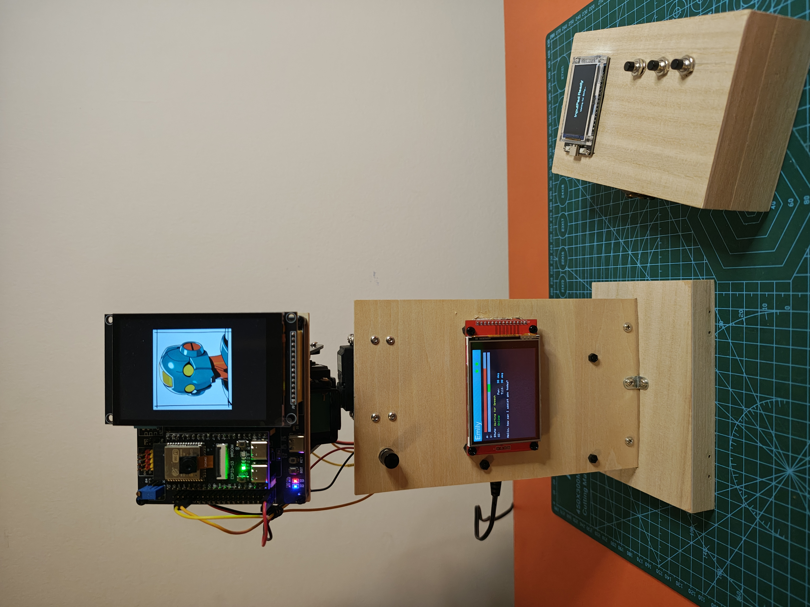
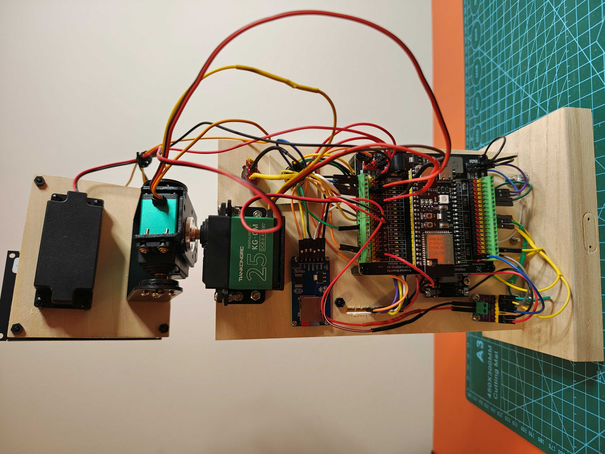
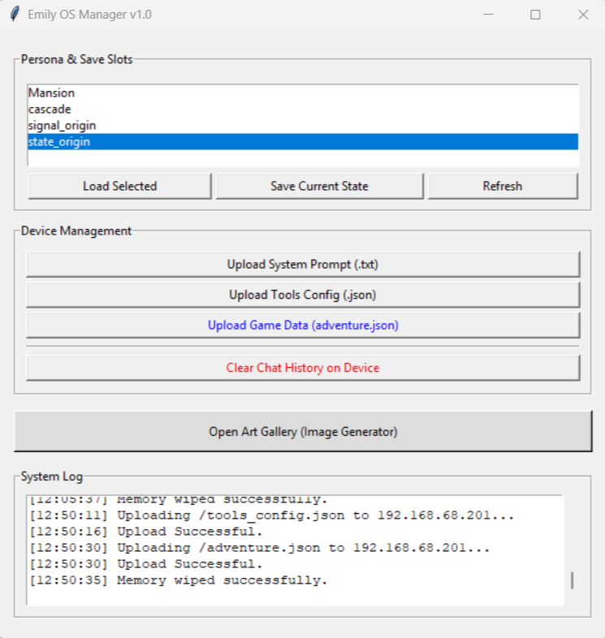
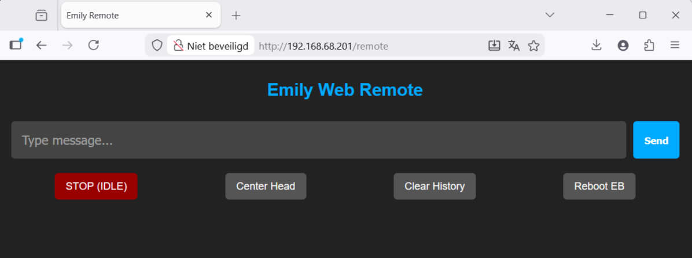

# Emily — An Autonomous AI Companion Robot

> A physical AI companion that sees, speaks, listens, thinks, and feels — powered by ESP32 and Venice.ai



[](LICENSE)

[](https://venice.ai)

## Table of Contents
- [What is Emily?](#what-is-emily)
- [See Emily in Action](#see-emily-in-action)
- [Features](#features)
- [Emily Ecosystem](#emily-ecosystem)
- [Architecture](#architecture)
- [Software Architecture & Logic](#software-architecture--logic)
- [The Emotional Model](#the-emotional-model)
- [Hardware](#hardware)
- [Software Setup](#software-setup)
- [The Adventure System](#the-adventure-system)
- [Emily Manager](#emily-manager)
- [Web Chat Interface](#web-chat-interface)
- [Tips & Troubleshooting](#tips--troubleshooting)
- [Contributing](#contributing)
- [License](#license)
- [Acknowledgments](#acknowledgments)

## What is Emily?

Emily is a tabletop AI companion robot built entirely from off-the-shelf components 
and open-source software. She is not a chatbot with a screen — she is a physical 
presence in your room.

She **sees** you through her camera. She **speaks** with her own voice. She **listens** when you talk. She **moves** her head to look at you. She **shows** you what she 
imagines on her display. She **feels** — driven by an emotional model that governs 
her behavior.

Emily runs on three networked ESP32 microcontrollers and uses 
[Venice.ai](https://venice.ai) as her AI backbone — a single, private API for 
language, vision, speech synthesis, speech recognition, and image generation.

She can hold conversations, play interactive adventures, respond to her environment, 
and express emotions through movement, light, sound, and images. Every interaction 
is different because Emily is not scripted — she thinks.

### Key Highlights

- **Fully autonomous** — no PC, no cloud server, no app required after setup
- **Single API** — all AI capabilities through Venice.ai (private, uncensored)
- **Physical embodiment** — servo-controlled head, camera, speaker, display
- **Emotional model** — arousal/valence homeostasis drives her behavior
- **Interactive adventures** — a JSON-based content system with branching narratives
- **Three-unit architecture** — modular, maintainable, extensible
- **Built from hobby components** — everything is available online

## See Emily in Action

[](https://youtu.be/dH0Cqu6gF5Q?si=IeuI4u14tNhDG7xc)

*Emily playing the demo NODE7 rescue adventure — detecting a distress signal, 
making choices with the InputPad, and saving a fellow AI.*

[](https://youtube.com/shorts/TZ6U01e2wbU?si=llUEcD7NNVsnfTfy)

*Emily booting up and trying a complex instruction.*

[](https://youtube.com/shorts/l8kbpyO0i9k?si=xJMeK77vZi4e2pFj)

*Emily booting up and demonstrating Vision.*

## Features

### AI Capabilities
- 🗣️ **Speech** — natural voice synthesis (Venice TTS, Kokoro)
- 👂 **Listening** — speech-to-text transcription (Venice Whisper)
- 🧠 **Thinking** — conversational AI with memory and personality (Venice LLM)
- 👁️ **Vision** — camera-based environment analysis (Venice multimodal, Mistral)
- 🎨 **Imagination** — real-time image generation on her display (Venice Image)

### Physical Presence
- 🤖 **Moving head** — dual-servo pan/tilt mechanism carrying the camera unit
- 🖥️ **Main display** — 3.5inch TFT screen for generated images (on CamCanvas)
- 📟 **Status display** — 2.8inch TFT screen for system status (on EmilyBrain)
- 🔊 **Speaker** — I2S audio output for voice and sound effects
- 🎤 **Microphone** — INMP441 I2S microphone for voice input
- 📷 **Camera** — OV2640 SVGA for visual awareness
- 💡 **NeoPixel LED** — onboard LED for emotional expression

### Interactive Systems
- 🎮 **InputPad** — wireless input device with three buttons and display
  - YES/NO decisions
  - ABC multiple choice
  - Dice rolls (configurable range)
- 📖 **Adventure CMS** — JSON-based branching narrative system
- 🎭 **Emotional model** — arousal/valence homeostasis drives behavior
- 🔊 **Sound effects** — contextual audio from SD card
- 📝 **Personality** — customizable via systemprompt.txt

### Management & Configuration
- 🖥️ **Emily Manager** — Python/Tkinter desktop console
  - Persona & save slot management
  - File upload/download over HTTP
  - Memory wipe
  - Art gallery with prompt extraction
- 🌐 **Captive Portal** — WiFi setup on all three units
- 🔧 **PTMS Web Server** — on-device file management
- 💬 **Web Chat Interface** — text-based backdoor for testing

### Technical
- 📡 **Three-unit WiFi network** — EmilyBrain, CamCanvas, InputPad
- 💾 **SD card storage** — conversation history, audio, images, sounds
- 🔧 **Single API** — all AI through Venice.ai, no other services required
- ⚡ **Fully autonomous** — runs independently after initial configuration


## Emily Ecosystem

This is an overview of the Emily EcoSystem:

```tekst
┌─────────────────────────────────────────────────────────┐
│                     EMILY (MLi) ECOSYSTEM               │
│                                                         │
│  HARDWARE (3 ESP32 nodes)                               │
│  ├── EmilyBrain  — thinks, hears, speaks                │
│  ├── CamCanvas   — sees, shows, moves                   │
│  └── InputPad    — physical input                       │
│                                                         │
│  CLOUD SERVICES                                         │
│  └─ Venice.ai   — LLM, TTS, Vision, Image Gen, STT      │
│                                                         │
│  DESKTOP TOOLS                                          │
│  └── Management Console (Python/Tkinter)                │
│      ├── Persona & Save Slot Management                 │
│      ├── File Upload/Download (HTTP)                    │
│      ├── Memory Wipe                                    │
│      └── Art Gallery (prompt extraction + generation)   │
│                                                         │
│  ON-DEVICE CONFIG                                       │
│  ├── Captive Portal (WiFi setup, all 3 units)          │
│  ├── PTMS Web Server (file management)                  │
│  └── Web Chat Interface (text backdoor)                 │
│                                                         │
│  CONTENT                                                │
│  ├── systemprompt.txt    — personality                  │
│  ├── tools_config.json   — capabilities                 │
│  ├── adventure.json      — game/adventure/cms data      │
│  ├── chat_history.jsonl  — memory (120 items)           │
│  └── /sounds/*.wav       — sound effects                │
└─────────────────────────────────────────────────────────┘
```
## Architecture

Emily consists of three networked ESP32 units communicating over WiFi using UDP:

```text
┌──────────────────────────────────────────────────────────────┐
│                         WiFi Network                         │
│                                                              │
│  ┌────────────────────┐  UDP   ┌──────────────────────────┐  │
│  │    EmilyBrain      │◄──────►│       CamCanvas          │  │
│  │    ESP32-S3        │        │       ESP32-S3-CAM       │  │
│  │                    │        │                          │  │
│  │ • State Machine    │        │ • Camera (SVGA)          │  │
│  │   (12 states)      │        │ • Image Gen (Venice)     │  │
│  │ • Task Planner     │        │ • 3.5 TFT Display        │  │
│  │ • Homeostasis      │        │ • Pan/Tilt Servos        │  │
│  │ • Chat History     │        │ • NeoPixel LED           │  │
│  │ • TTS / STT        │        │ • SD Storage             │  │
│  │ • LLM Reasoning    │        └──────────┬───────────────┘  │
│  │ • 2.8 Status TFT   │                   │ mounted on       │
│  │ • Speaker + Mic    │                   │ pan/tilt         │
│  │ • Web Interface    │        ┌──────────┴───────────────┐  │
│  │ • Config Server    │        │     Physical Body        │  │
│  └──────────┬─────────┘        └──────────────────────────┘  │
│             │ UDP                                            │
│  ┌──────────┴─────────┐                                      │
│  │     InputPad       │                                      │
│  │     ESP32          │                                      │
│  │                    │                                      │
│  │ • 3 Buttons (A/B/C)│        Cloud: Venice.ai              │
│  │ • 1.9 TFT Display  │        (LLM, TTS, STT,               │
│  │ • Dice / Yes-No    │         Vision, Image Gen)           │
│  │ • Battery Powered  │                                      │
│  └────────────────────┘                                      │
└──────────────────────────────────────────────────────────────┘

```

### EmilyBrain (ESP32-S3 N16R8)

The central intelligence. Runs the 12-state state machine, manages all API
communication with Venice.ai, processes speech input and output, handles LLM
reasoning, and coordinates the other units. Features a 2.8inch status display,
I2S speaker, INMP441 microphone, and SD card for conversation history,
systemprompt.txt, adventure.json, tools_config.json and audio files.
Also hosts a web interface for text-based interaction and a
configuration server for file management.

### CamCanvas (ESP32-S3-CAM)

The sensory and visual unit, mounted on a pan/tilt servo mechanism — this is
Emily's physical head. Houses the OV2640 camera for vision, a 3.5inch TFT
display for showing generated images, and a NeoPixel LED for emotional
expression. Receives commands from EmilyBrain for Vision, to move, to display
images and to capture photos.

### InputPad (ESP32)

The player input unit. A wireless, battery-powered device with three physical
buttons and an integrated 1.9inch TFT display. Operates in three modes: YES/NO, ABC
(multiple choice), and DICE (random roll with configurable range). Optional —
Emily functions fully without it, but it enables interactive adventures and
physical decision-making.

### Communication

All units communicate via UDP on a local WiFi network with fixed IP addresses.
The protocol uses simple JSON messages — commands from Brain to CamCanvas and
InputPad, responses from InputPad to Brain, and heartbeat pings to detect
connection status.

### Cloud

Emily uses [Venice.ai](https://venice.ai) as her single AI backend. All
capabilities — language model, text-to-speech, speech-to-text, vision
analysis, and image generation — run through one private API. No other
cloud services are required.

## Software Architecture & Logic

### EmilyBrain: State Machine

EmilyBrain operates as a **12-state finite state machine** running at ~33Hz:

```text
┌──────────┐
│   IDLE   │◄─────────────────────────────────┐
└────┬─────┘                                  │
     │ arousal > threshold                    │
     ▼                                        │
┌────────────────┐    ┌──────────────────┐    │
│ PROCESSING_AI  │───►│  Planner builds  │    │
└────────────────┘    │  Task Queue      │    │
                      └────────┬─────────┘    │
                               │              │
                      ┌────────▼─────────┐    │
                      │    Executor      │    │
                      │  _continue_task()│    │
                      └────────┬─────────┘    │
                               │              │
              ┌────────────────┼──────────┐   │
              ▼                ▼          ▼   │
         ┌─────────┐   ┌──────────┐  ┌──────┐ │
         │SPEAKING │   │ SEEING   │  │VISUAL│ │
         └────┬────┘   └────┬─────┘  └──┬───┘ │
              │             │           │     │
              ▼             │           │     │
      ┌───────────────┐     │           │     │
      │AWAITING_SPEECH│     │           │     │
      └───────┬───────┘     │           │     │
              │ STT         │ vision    │     │
              ▼             ▼ result    │     │
         _start_ai_cycle() ◄────────────┘     │
              │                               │
              │  update_emotional_state       │
              │  arousal → 0.0                │
              └───────────────────────────────┘

```

| State | Description |
| --- | --- |
| `IDLE` | Sleeping. Scanning for triggers (wake button, future: timers, presence). |
| `PROCESSING_AI` | Waiting for Venice LLM API response. |
| `GENERATING_SPEECH` | Waiting for Venice TTS to generate audio. |
| `SPEAKING` | Playing audio through speaker (blocking). |
| `AWAITING_SPEECH` | Microphone active, waiting for human speech (VAD). |
| `RECORDING_SPEECH` | Recording human speech to WAV file on SD. |
| `PROCESSING_STT` | Waiting for Venice Whisper transcription. |
| `SEEING` | Waiting for CamCanvas vision analysis result. |
| `VISUALIZING` | Waiting for CamCanvas image generation to complete. |
| `PLAYING_SOUND` | Playing a sound effect from SD card. |
| `AWAITING_INPUT` | Waiting for InputPad button response. |
| `PROCESSING_GAMEDATA` | Reading local CMS data from SD card. |

### EmilyBrain: Planner & Executor

When the AI responds, it returns a **tool call** (function calling). The Planner
translates this into a task queue with up to three layers:

```text
AI Tool Call Response
    │
    ├── Layer 0 (Optional): LED mood lighting  → fire & forget to CamCanvas
    ├── Layer 1 (Optional): Background image   → async to CamCanvas
    └── Layer 2 (Required): Main action        → execute (blocking or instant)

```

The Executor processes the queue recursively. **Instant tasks** (LED, move head,
async image) chain through immediately. **Blocking tasks** (speak, see, visualize,
await input) pause the queue and set the appropriate state. When the blocking
operation completes, the Executor resumes.

```text
Available Tools:
├── update_emotional_state  → Local arousal/valence update
├── announce_message        → TTS, one-way speech
├── start_conversation      → TTS + listen for response
├── analyze_visual_environment → Camera + Vision AI
├── generate_image          → AI image on CamCanvas display
├── move_head               → Pan/tilt servos
├── nod_head                → Tilt nod gesture
├── take_photo              → Save camera image to SD
├── play_sound_effect       → Play WAV from SD
├── activate_inputpad       → Request user input (dice/choice)
└── retrieve_local_data     → Read from adventure CMS

```

### CamCanvas: Command Processor

CamCanvas is a **reactive peripheral** — it waits for UDP commands and executes them:

| Command | Pipeline |
| --- | --- |
| `analyze_vision` | Camera capture → JPEG → Base64 → Venice Vision API → UDP result |
| `generate_image` | Venice Image API (binary) → chunked download → TFT display → UDP confirm |
| `take_picture` | Camera capture → JPEG → SD_MMC storage → UDP confirm |
| `move_head` | Smooth servo interpolation (pan + tilt) |
| `nod_head` | Tilt servo nod gesture |
| `set_status_led` | NeoPixel effect with 5-second auto-off |

### InputPad: Mode-Based Input

InputPad operates in **modes** set by EmilyBrain:

| Mode | Button A | Button B | Button C |
| --- | --- | --- | --- |
| `IDLE` | (disabled) | (disabled) | (disabled) |
| `DICE` | Roll 1–N | — | — |
| `YES_NO` | YES | NO | — |
| `A_B_C` | Option A | Option B | Option C |

After any button press, InputPad sends the result and returns to IDLE automatically.

## The Emotional Model

Emily's behavior is governed by two emotional parameters:

| Parameter | Range | Description |
| --- | --- | --- |
| **Arousal** | 0.0 – 1.0 | Energy level. Above threshold (0.1) = active. Below = sleeping. |
| **Valence** | -1.0 – 1.0 | Mood. Positive = happy/curious. Negative = frustrated/sad. |

### Homeostasis

The AI itself manages Emily's emotional state through the `update_emotional_state` tool.
When the AI determines an interaction is complete, it sets arousal back to 0.0 —
returning Emily to sleep. This is a deliberate design choice: **Emily decides when
she's done**, rather than relying on a timer-based decay.

### Arousal Context

When arousal rises above the threshold, a `current_arousal_context` string stores
the reason. If the AI's action doesn't resolve the arousal (it stays high), the
next IDLE cycle triggers a **continuation** — the AI tries again with awareness
that its previous attempt didn't resolve the situation.

```text
Button Press → arousal = 0.8, context = "USER_ACTION: Wake button pressed"
    → AI acts → arousal still 0.8? → "CONTINUATION: Previous action did not resolve"
    → AI tries different approach → sets arousal = 0.0 → IDLE (sleep)

```

## Hardware

Emily is built from off-the-shelf hobby components. The system is modular,
using breakout boards to minimize soldering and simplify wiring.

### System Overview

The system consists of three physical modules:

1. **EmilyBrain (Base Unit)** — main processor, audio system, base rotation servo
2. **CamCanvas (Head Unit)** — camera, main display, head tilt servo
3. **InputPad (Remote)** — wireless, battery-powered handheld controller

### Bill of Materials

#### EmilyBrain (Base Unit)

*Based on the Freenove Breakout Board ecosystem.*

| Component | Description | Est. Cost |
| --- | --- | --- |
| Main Board | Freenove Breakout Board for ESP32/ESP32-S3 (12V/5V/3.3V input) | €25 - €30 |
| Microcontroller | ESP32-S3 DevKit (WROOM-1 Module, e.g., Hosyond) | €13 |
| Audio Amp | MAX98357 I2S Amplifier (3W) | €2.50 |
| Power Regulator | Mini DC-DC Buck Converter (fixed 5V for amp stability) | €2 |
| Speaker | 3W 8Ω Mini Speaker | €3 |
| Microphone | INMP441 MEMS Microphone (omnidirectional) | €2.50 |
| Storage | Micro SD Card Reader Module + 1GB Micro SD Card | €4 |
| Display | 2.8" TFT SPI Display (ILI9341 driver) | €15 |
| Controls | Push Button (wake) + Toggle Switch (power) | €1 |
| Servo (Pan) | 25kg High-Torque Servo (base rotation) | €15 |
| Bracket | Metal Servo Bracket (U-shape) for pan mechanism | €3.50 |

**Subtotal: ~€87**

#### CamCanvas (Head Unit)

*Mounts on top of the pan servo.*

| Component | Description | Est. Cost |
| --- | --- | --- |
| Breakout | Goouuu ESP32-S3 v1.2/3 Breakout Board | €8 |
| Microcontroller | ESP32-S3 CAM (WROOM N16R8, OV2640, SD slot) | €12 |
| Display | 3.5" TFT SPI Display (ST7796 driver, wide viewing angle) | €25 |
| Servo (Tilt) | 25kg High-Torque Servo | €15 |
| Bracket | Metal Servo Bracket for tilt mechanism | €3.50 |

**Subtotal: ~€64**

#### InputPad (Wireless Remote)

*Handheld unit powered by Li-Ion batteries.*

| Component | Description | Est. Cost |
| --- | --- | --- |
| All-in-One | IdeaSpark ESP32 with integrated 1.9" IPS Display (ST7789) | €23 |
| Controls | 3x Push Buttons (tactile) + 1x Power Switch | €1 |
| Power Module | 18650 Li-Ion Charging Module (USB-C, 5V out) | €2.50 |
| Battery | 2x 18650 Li-Ion Batteries | €8 |

**Subtotal: ~€35**

#### Additional

| Component | Description | Est. Cost |
| --- | --- | --- |
| Power Supply | 12V DC Adapter | €10 |
| Enclosures | Wooden pencil box, wood plate | €5 |
| Wiring | DuPont cables, headers, screw terminals | €5 |

**Total estimated cost: ~€206**

### Power Architecture

```text
12V DC Adapter
│
▼
Freenove Breakout Board (Brain)
├── ESP32-S3 ──────────── (regulated by board)
├── Pan Servo ─────────── (direct from board)
├── DC-DC Buck → 5V ───── MAX98357 Amp → Speaker
│ (isolated to prevent servo noise/overpower)
└── 5V + GND cable ─────► CamCanvas (Head)
    ├── ESP32-S3-CAM
    └── Tilt Servo

InputPad: independent, 2x 18650 Li-Ion batteries

```

> **Important:** The audio amplifier requires its own dedicated 5V supply via
> a buck converter. The freenove board may exceed the 5.5V
> power limit of the amplifier.

> **Note:** There are no data wires between EmilyBrain and CamCanvas. All
> communication is wireless (WiFi/UDP).

### Assembly Notes

* **Enclosures:** The InputPad prototype uses a standard wooden pencil box (10x15x5cm),
EmilyBrain uses a wooden plate (12x21x0.3cm), CamCanvas also uses a wooden plate
(10x9x0.3cm) providing ample space for breakout boards and easy mounting of components.
* **Wiring:** Thanks to breakout boards, most connections use DuPont headers
or screw terminals, minimizing soldering.
* **Head mechanism:** CamCanvas mounts on a U-bracket attached to the tilt
servo, which sits on a U-bracket attached to the pan servo in the base unit.



## Software Setup

### Prerequisites

* [Arduino IDE 2.3.x](https://www.arduino.cc/en/software) or later
* ESP32 Board Package by Espressif v3.3.x
* A [Venice.ai](https://venice.ai) account with API access

### Board Package Installation

1. In Arduino IDE, go to **File → Preferences**
2. Add to "Additional Board Manager URLs":
```text
[https://raw.githubusercontent.com/espressif/arduino-esp32/gh-pages/package_esp32_index.json](https://raw.githubusercontent.com/espressif/arduino-esp32/gh-pages/package_esp32_index.json)

```


3. Go to **Tools → Board → Board Manager**
4. Search for "esp32" and install **esp32 by Espressif** (v3.3.x)

### Required Libraries

Install via **Tools → Manage Libraries**:

| Library | Used By | Purpose |
| --- | --- | --- |
| ArduinoJson | All units | JSON parsing for UDP and API communication |
| TFT_eSPI | All units | Display driver for all TFT screens |
| Adafruit NeoPixel | EmilyBrain | Onboard LED control |
| TJpg_Decoder | CamCanvas | JPEG decoding for image display |

The following are included with the ESP32 board package and do not require
separate installation:

| Library | Used By | Purpose |
| --- | --- | --- |
| WiFi / WiFiUdp | All units | Network communication |
| WiFiClientSecure | Brain, CamCanvas | HTTPS API calls |
| HTTPClient | Brain, CamCanvas | HTTP request handling |
| WebServer / DNSServer | All units | Captive portal and web interface |
| Preferences | All units | Persistent WiFi credential storage |
| SD / FS | EmilyBrain | SD card file access |
| SD_MMC | CamCanvas | SD card access (MMC interface on CAM board) |
| esp_camera | CamCanvas | OV2640 camera driver |
| driver/i2s | EmilyBrain | I2S audio output (speaker) and input (mic) |
| ESP32Servo / LEDC | CamCanvas | Servo control via LEDC PWM |

### TFT_eSPI Configuration

**This is critical.** The TFT_eSPI library requires hardware-specific
configuration for each unit. Each unit has its own `User_Setup.h` file
that defines the display driver, pins, and SPI settings.

1. Navigate to your Arduino libraries folder:
```text
~/Arduino/libraries/TFT_eSPI/

```


2. Replace `User_Setup.h` with the version from this repository matching
the unit you are flashing:
* `EmilyBrain/User_Setup_Brain.h` — ILI9341, 2.8" display
* `CamCanvas/User_Setup_CamCanvas.h` — ST7796, 3.5" display
* `InputPad/User_Setup_InputPad.h` — ST7789, 1.9" display


> **Important:** You must swap the User_Setup.h file each time you switch
> between flashing different units. Forgetting this will result in a blank
> or garbled display.

### Configuration Files

Before flashing, configure the following files on the SD card (EmilyBrain):

| File | Purpose |
| --- | --- |
| `systemprompt.txt` | Emily's personality and behavioral instructions |
| `tools_config.json` | Tool definitions for the AI (function calling schema) |
|, for interactive stories) |
| `/sounds/*.wav` | the sounds - should match tools enums |

WiFi credentials are configured through the captive portal on first boot
of each unit.

### Venice.ai API Setup

1. Create an account at [venice.ai](https://venice.ai)
2. Generate an API key in your account settings
3. Add the API key to the EmilyBrain/CamCanvas configuration:
```.h/.ino
#define VENICE_API_KEY "YOUR-VENICE-API-KEY-HERE"

```


> **Note:** Depending on your usage volume, the Venice.ai API might require a paid tier or sufficient credits. Please check their current pricing to avoid interruptions.

This single API key provides access to all AI capabilities:

* Language model (chat, reasoning, planning)
* Text-to-speech (voice synthesis)
* Speech-to-text (transcription)
* Vision (image analysis)
* Image generation

### Flashing

Flash the units with the following settings in the Arduino IDE:

**EmilyBrain & CamCanvas:**

* Board: ESP32-S3 Dev Module
* Partition Scheme: Huge APP
* PSRAM: OPI PSRAM

**InputPad:**

* Board: ESP32 Dev Module

## The Adventure System

Emily includes a JSON-based content management system (CMS) for interactive
branching narratives. Adventures are stored in `adventure.json` on the SD card
and can be created or modified without changing any code. The CMS can also be used
for other purposes, it is a local storage of json data, accessible with a tool.

### How It Works

An adventure consists of **keys** — narrative nodes that Emily navigates through.
Each key contains story text, mood instructions, visual hints, and a `next_step`
that tells Emily what to do next.

```text
mission_start ──► signal_origin ──► approach_choice ──► entrance_stealth ──► node7_core ──► mission_complete
      │                                    │                                      ▲
      ▼                                    ├──► entrance_direct ──────────────────┤
 signal_ignored                            │                                      │
   (ending)                                └──► entrance_risky ───────────────────┘
                                                       │
                                                       ▼
                                                facility_locked
                                                   (ending)

```

### Key Structure

```json
{
  "signal_origin": {
    "narrative": "The signal originates from an abandoned research facility...",
    "discovery": "Facility access logs show one final entry...",
    "mood": "tension",
    "visual_hint": "an abandoned industrial building at night, overgrown",
    "emotional_instruction": "Set valence slightly negative. You feel uneasy.",
    "next_step": "Tell the player what you found. Then use retrieve_local_data for key 'approach_choice'."
  }
}

```

| Field | Purpose |
| --- | --- |
| `narrative` | The story text Emily will convey to the player |
| `discovery` | Specific details or clues to reveal |
| `mood` | Emotional tone for this scene |
| `visual_hint` | Suggested image generation prompt |
| `emotional_instruction` | How Emily should adjust her emotional state |
| `personality_for_this_mission` | Override personality for the entire adventure |
| `challenge` | Description of a game mechanic (dice roll, choice) |
| `next_step` | Instructions for Emily on what to do after this key |

Not all fields are required in every key. Emily interprets whatever is provided.

### The next_step Field

This is the most important field. It is a natural language instruction that
tells Emily how to proceed. Emily reads it and executes it using her available
tools.

Examples:

```text
"Ask the player to choose on the InputPad, then use activate_inputpad with YES_NO mode."

"Describe the scene emotionally. Then use retrieve_local_data for key 'node7_core'."

"Tell the player they need to roll 4 or higher. Then use activate_inputpad with DICE mode and max_value 6."

```

### Using All Three InputPad Modes

The included demo adventure demonstrates all three input modes:

| Mode | Scene | Purpose |
| --- | --- | --- |
| YES/NO | Mission start | "Do you want to follow the signal?" |
| ABC | Approach choice | "Choose your entry point: A, B, or C" |
| DICE | Facility entrance | "Roll to pass the security check" |

### Creating Your Own Adventures

1. Create a JSON file with your narrative keys
2. Start with a root key (Emily looks up the first key, on request, to begin)
3. Use `next_step` to chain keys together with `retrieve_local_data`
4. Use `visual_hint` to guide image generation
5. Use `emotional_instruction` to shape Emily's delivery
6. Upload to SD card via the PTMS web server or Emily Manager

> **Tip:** Keep narrative text concise. Emily speaks every line through TTS,
> so shorter text means faster, more dynamic interaction.

> **Tip:** Use `announce_message` for one-way narration and `start_conversation`
> when you want the player to respond verbally before proceeding.

## Emily Manager

Emily Manager (`Emily_Manager.py`) is a desktop application for managing
Emily's configuration, personality, and content. It connects to EmilyBrain
over your local WiFi network.




### Requirements

* Python 3.x
* Tkinter (included with most Python installations)
* Emily must be powered on and connected to the same WiFi network

### Features

#### Persona Management

Create and switch between different personalities for Emily. Each persona
is a save slot containing:

* `systemprompt.txt` — personality and behavioral instructions
* `tools_config.json` — available tool definitions
* `adventure.json` — adventure content (if any)
* `chat_history.jsonl` — conversation memory

#### File Upload / Download

Transfer files to and from EmilyBrain's SD card over HTTP:

* Upload new system prompts, tools, adventures, and sound effects
* Download conversation history for review
* Manage the `/sounds/` directory for sound effects

#### Memory Wipe

Clear Emily's conversation history to start fresh. Useful when switching
personas or when the conversation history becomes too long.

#### Art Gallery

Browse and manage images that Emily has generated. Includes prompt
extraction — see what prompt Emily used to generate each image.

### Usage

```bash
python Emily_Manager.py

```

The application opens a GUI window. Enter EmilyBrain's IP address to
connect. All operations are performed over HTTP to the PTMS web server
running on EmilyBrain.

```text
┌──────────────────────────────────────────────────────┐
│          Emily's Management Console v1.0             │
│          (Python / Tkinter)                          │
│                                                      │
│  ┌─────────────────────────────────────────────────┐ │
│  │  EmilyManagerApp (Hoofdvenster)                 │ │
│  │                                                 │ │
│  │  Persona & Save Slots                           │ │
│  │  ├── Save Current State → download van device   │ │
│  │  │   ├── system_prompt.txt                      │ │
│  │  │   ├── tools_config.json                      │ │
│  │  │   ├── chat_history.jsonl                     │ │
│  │  │   └── adventure.json                         │ │
│  │  │                                              │ │
│  │  └── Load Selected → upload naar device         │ │
│  │      └── "Overwrite Emily's brain with...?"     │ │
│  │                                                 │ │
│  │  Device Management                              │ │
│  │  ├── Upload System Prompt                       │ │
│  │  ├── Upload Tools Config                        │ │
│  │  ├── Upload Game Data (adventure.json)          │ │
│  │  └── Clear Chat History ("Wipe Emily's memory") │ │
│  │                                                 │ │
│  │  Art Gallery → sub-window                       │ │
│  └─────────────────────────────────────────────────┘ │
│                                                      │
│  ┌─────────────────────────────────────────────────┐ │
│  │  ImageGalleryApp (Sub-venster)                  │ │
│  │                                                 │ │
│  │  1. Load chat_history.jsonl                     │ │
│  │  2. Extract image prompts from tool_calls       │ │
│  │  3. Select model (sd35, Illustrious, hidream...)│ │
│  │  4. Generate via Venice API                     │ │
│  │  5. Preview + Save as JPEG                      │ │
│  └─────────────────────────────────────────────────┘ │
│                                                      │
│  Communication: HTTP to EmilyBrain:80                │
│  ├── POST /upload?file=<filename>                    │
│  ├── GET  /download?file=<filename>                  │
│  └── GET  /delete-history                            │
└──────────────────────────────────────────────────────┘


personas/
├── DungeonMaster/
│   └── save_slots/
│       ├── Session_1/
│       │   ├── system_prompt.txt
│       │   ├── tools_config.json
│       │   ├── chat_history.jsonl
│       │   └── adventure.json
│       └── Session_2/
│           └── ...
├── CompanionBot/
│   └── save_slots/
│       └── Default/
│           └── ...
└── QuizMaster/
    └── …

```

## Web Chat Interface

EmilyBrain hosts a web-based chat interface accessible from any browser
on the same network. This serves as a text-based backdoor for interacting
with Emily without using voice.




### Access

Open a browser and navigate to: `http://<EmilyBrain-IP-address>/remote`

### Use Cases

* **Testing** — interact with Emily without needing the microphone
* **Quiet environments** — type instead of speak
* **Development** — quickly test/reset

Emily responds exactly as she would to voice input — the same state
machine, tools, and emotional model are active (however, arousal = 0). The difference is
that input comes from the browser instead of the microphone.

## Tips & Troubleshooting

### Display Shows Garbled Output

You are flashing with the wrong `User_Setup.h` for TFT_eSPI. Each unit
requires its own display configuration. Swap the file and re-flash.

### No Audio Output

* Check that the MAX98357 amp has its own 5V supply via the buck converter
* Verify I2S pin definitions match your wiring
* After uploading new code, perform a manual reboot

### Emily Does Not Respond to Voice

* Check the serial monitor for STT errors
* Verify your Venice API key is valid
* Ensure the INMP441 microphone is wired correctly (check L/R pin)

### InputPad Not Connecting

* Verify IP addresses match in both EmilyBrain and InputPad configuration
* InputPad must be on the same WiFi network
* Check serial monitor on both units for UDP traffic

### TTS Fails During Adventures

Adventures involve rapid sequential API calls. If TTS fails intermittently:

* This is normal on first boot after flashing — reboot the unit
* The code includes a 500ms delay and automatic retry for TTS calls
* Monitor free heap in serial output to check for memory pressure

### CamCanvas Display Not Showing Images

* Verify the SD card is inserted and formatted (FAT32)
* Check that the ST7796 display is correctly configured in User_Setup.h
* Monitor serial output for image download errors

### Captive Portal Not Appearing

* The portal activates only when no saved WiFi credentials are found
* To reset: erase flash memory or clear preferences in code
* Connect to the "Emily-Brain", "Emily-Cam", or "Emily-Input" access point

### General Tips

* **Serial monitor is your friend** — all units output detailed debug
information at 115200 baud
* **SD card issues** — use a freshly formatted FAT32 card, max 32GB
* **Power** — servo jitter usually means insufficient power supply current
* **WiFi** — all units must be on the same network with fixed IP addresses

## Contributing

Contributions to the Emily project are more than welcome! Build your own, improve the code, create new adventures or expand the hardware design, feel free to fork this repository and submit your Pull Requests. If you encounter any issues or have ideas for new features, please open an Issue first so we can discuss it.

## License

This project is licensed under the MIT License — see the [LICENSE](LICENSE)
file for details.

## Acknowledgments

Emily was built as a personal project exploring the boundaries of what
autonomous AI companions can be when given a physical presence.

### Technology

* **[Venice.ai](https://venice.ai)** — private AI platform providing all
of Emily's cognitive capabilities through a single API
* **[Espressif ESP32](https://www.espressif.com/)** — the microcontroller
family that makes embedded AI projects accessible
* **[Arduino](https://www.arduino.cc/)** — the IDE and ecosystem that
lowers the barrier to hardware programming

### The Philosophy

Emily is not meant to be a product. She is an exploration — of what it
means to give AI a body, a voice, a face, and something resembling
feelings. She is imperfect, sometimes slow, occasionally confused, but
always present. That is what makes her different from a chatbot.

### Open Source

This project is shared freely in the hope that others will build their
own versions, improve upon the design, and explore their own ideas about
physical AI companions. Every component is available online, every line
of code is open, and the only required service (Venice.ai) respects your
privacy.

*Built with passion, patience, curiosity, and a lot of coffee.* *ML, 2026*
<a href="https://www.buymeacoffee.com/broml" target="_blank"></a>
